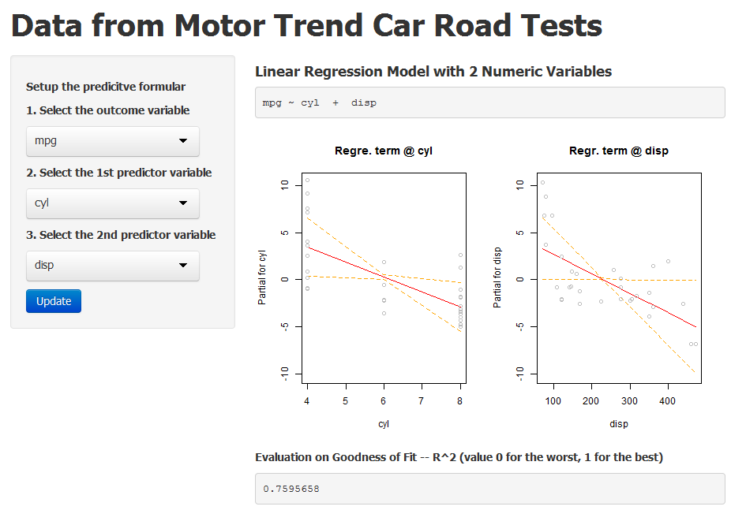

## Introduction
* Background
  + course project of "__developing data product__"
  + among the specification __Data Science__ provided __Cousera__
* Motivation
  + Learn to develop R-based application with __Shiny__
  + Learn to write presentation slides with __Slidify__
  + Learn to deploy the application on __Shiny Server__ and publish the documentation on __Github__

---
## Dataset
* Motor Trend Car Road Tests (mtcars)

```r
## list all numeric variables
names(mtcars)[lapply(mtcars,class)=="numeric"]
```

 [1] "mpg"  "cyl"  "disp" "hp"   "drat" "wt"   "qsec" "vs"   "am"   "gear"
[11] "carb"

--- 
## Input as Predictive Formular
* Rules applied in this project
  + __Any one__ variable as the "outcome
  + __Any two other__ variables as the "predictors"
* Note
  + Make sure there are all different from each other.
  + Otherwise, you got __"Error at input formular"__

---
## Output from Linear Regression Model
* Two plots for two variables respectively
  + Fitted Regression Line against each variable
  + Residuals and Standard Error at sample points
* Evaluation of Goodness-of-Fit
  + __R^2__ is single and strong indicator in statistics
  + Value 0 for the worst and 1 for the perfect

---
## Example Screen Shot

